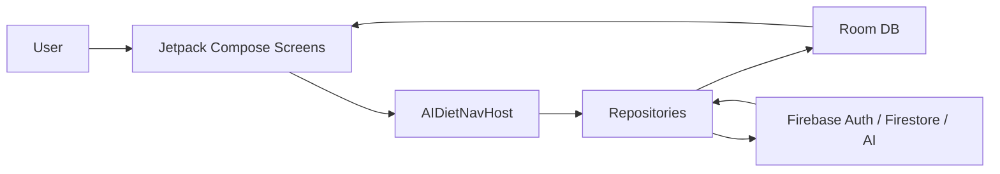

# Coachie AI

Coachie AI is an Android diet management app that helps users set nutrition goals and record meals with AI assistance.

The app was designed around the idea that dieting, bulking, and general body composition goals become easier when users can quickly log what they eat and immediately see how well their intake matches their target. Users can upload a meal photo or write a free-form description, and AI automatically analyzes the nutrition profile. The app then compares calories and macros against the user's goals so they can manage their eating habits more clearly.

## Preview

  
  

## Key Features

### 1. Firebase Account Login

Users can sign up and log in with an email and password, and password reset emails are supported through Firebase Authentication. User-specific Room data is linked to each Firebase UID, keeping local data separated by account.

### 2. AI Meal Analysis and Meal Logging

Users can add a meal photo or description from the Add Meal screen. When they tap Analyze Meal, Gemini through Firebase generates a structured nutrition analysis. Users can adjust the details before saving, or save the result immediately. If AI analysis fails, the flow continues with a local nutrition estimation fallback.

  
  

### 3. Goal-Based Home Dashboard

The home dashboard compares today's calories, carbohydrates, protein, fat, fiber, sugar, and sodium against the user's goals. It clearly shows goal status with messages such as `Over goal by N kcal`.

Users can also swipe left and right to review when and how they logged meals across different dates.

### 4. AI Goal Planning and Body Logs

Users can enter body metrics such as current weight, skeletal muscle mass, body fat percentage, and basal metabolic rate to generate daily nutrition targets for a selected goal period. Each metric is optional, so users can save only the values they want to track.

Goal history is managed by date ranges, making it easier to review changes and understand progress over time.

  
  

### 5. Recent Stats and Meal Reminders

Recent meal records are grouped by date so users can review average intake and trends. The app also supports meal logging reminders for breakfast, lunch, and dinner.

### 6. Data Export/Import and Firebase Sync

From the Profile screen, users can export meal records, goal plans, and body measurement logs as JSON, then import them again later. After local data changes, the app uploads a user-specific snapshot to `users/{firebaseUid}/data/current`, and restores Firebase data into the Room database when the user logs in.

## Tech Stack

| Area         | Technologies                                                  |
| ------------ | ------------------------------------------------------------- |
| Language     | Kotlin                                                        |
| UI           | Jetpack Compose, Material3                                    |
| Navigation   | Navigation Compose                                            |
| Local DB     | Room Database, Flow                                           |
| Auth         | Firebase Authentication                                       |
| Cloud Data   | Cloud Firestore                                               |
| AI           | Firebase AI, Gemini                                           |
| Image        | Activity Result API, OpenDocument, persistable URI permission |
| Notification | AlarmManager, BroadcastReceiver                               |
| Build        | Gradle Kotlin DSL, Android Gradle Plugin, KSP                 |

## Architecture

