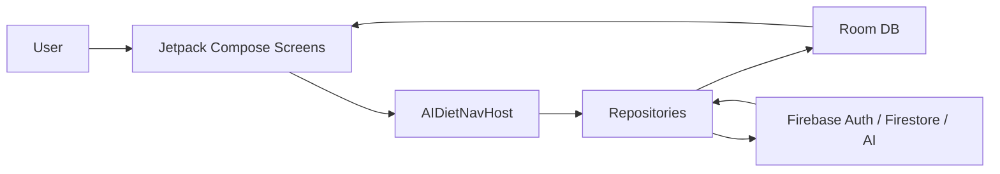

# Coachie AI

Coachie AI는 내가 목표하는 몸을 위해 AI의 도움을 받아 목표를 세우고, 먹는 음식들을 기록하는 Android 식단 관리 앱입니다.

사람들이 자신이 먹은 음식을 쉽게 기록하고, 목표를 위해 얼마나 잘 섭취하고 있는지 바로 확인할 수 있으면 다이어트와 벌크업이 더 쉬워질 수 있다고 생각해 기획했습니다. 사용자는 음식 사진과 설명을 바탕으로 AI 영양 분석을 받고, 목표 칼로리와 매크로 섭취량을 비교하며 자신의 식습관을 관리할 수 있습니다.

## Preview


## 주요 기능

### 1. Firebase 계정 기반 로그인

이메일과 비밀번호로 회원가입/로그인할 수 있고, Firebase Auth의 비밀번호 재설정 메일 발송을 지원합니다. 사용자별 Room 데이터는 Firebase UID와 연결되어 계정별로 분리됩니다.


### 2. AI 식단 분석 및 식사 기록

사용자는 한 끼에 여러 음식 항목을 입력하고, 각 음식에 사진과 설명을 추가할 수 있습니다. Firebase AI Gemini 분석 결과를 확인한 뒤 저장하며, AI 분석이 실패해도 로컬 영양 추정 로직으로 기록 흐름이 이어집니다.


### 3. 목표 기반 홈 대시보드

오늘 섭취 칼로리, 탄수화물, 단백질, 지방, 식이섬유, 당, 나트륨을 목표와 비교해 보여줍니다. 목표 초과 여부도 `Over goal by N kcal`처럼 명확하게 표시합니다.

### 4. AI 목표 설정 및 신체 기록

현재 체중, 골격근량, 체지방률, 기초대사량 등을 입력하면 목표 기간에 맞는 일일 영양 목표를 제안합니다. 인바디 측정값은 날짜별로 저장되고, 목표 변경 이력은 기간 기반으로 관리됩니다.


### 5. 최근 통계와 리마인더

최근 식단 기록을 날짜별로 묶어 평균 섭취량과 추세를 확인할 수 있습니다. 아침/점심/저녁 식사 기록 알림도 설정할 수 있습니다.


### 6. 사용자 데이터 export/import 및 Firebase 동기화

프로필 화면에서 현재 계정의 식사 기록, 목표 계획, 신체 측정 기록을 JSON으로 내보내고 다시 가져올 수 있습니다. 로컬 데이터 변경 후에는 `users/{firebaseUid}/data/current`에 사용자별 스냅샷을 업로드하고, 로그인 시 Firebase 데이터를 Room DB로 복원합니다.


## 기술 스택

| 구분 | 사용 기술 |
| --- | --- |
| Language | Kotlin |
| UI | Jetpack Compose, Material3 |
| Navigation | Navigation Compose |
| Local DB | Room Database, Flow |
| Auth | Firebase Authentication |
| Cloud Data | Cloud Firestore |
| AI | Firebase AI, Gemini |
| Image | Activity Result API, OpenDocument, persistable URI permission |
| Notification | AlarmManager, BroadcastReceiver |
| Build | Gradle Kotlin DSL, Android Gradle Plugin, KSP |

## 시스템 구조



## 자료 및 영상 링크

| 항목 | 링크 |
| --- | --- |
| 2분 요약 영상 | 추후 추가 예정 |
| 10분 상세 발표 영상 | 추후 추가 예정 |
| 프로젝트 최종 보고서 PDF | 추후 PDF 업로드 후 링크 연결 예정 |
| HTML 보고서 초안 | [docs/final_report.html](docs/final_report.html) |
| APK 다운로드 | 추후 Google Drive 업로드 후 링크 연결 예정 |
| 설치용 QR 코드 | APK 공유 링크 생성 후 QR 이미지 추가 예정 |

APK를 Google Drive에 업로드한 뒤 외부 공유를 허용하고, 공유 URL로 QR을 생성하면 됩니다. 예를 들어 `https://quickchart.io/qr?text=APK_URL` 형태로 QR 이미지를 만들 수 있습니다.

## 테스트 계정

| 사용자 | 이메일 |
| --- | --- |
| Sandy | `testmail1@gmail.com` |
| 김건국 | `testmail2@daum.com` |

비밀번호는 README에 공개하지 않고 발표/시연 환경에서만 사용합니다.

## 빌드 방법

```bash
JAVA_HOME=/Applications/Android\ Studio.app/Contents/jbr/Contents/Home ./gradlew :app:assembleDebug
```

생성된 APK 위치:

```text
app/build/outputs/apk/debug/app-debug.apk
```

에뮬레이터에서 Firebase 연결이 불안정할 때는 DNS 서버를 지정해 실행했습니다.

```bash
~/Library/Android/sdk/emulator/emulator -avd Medium_Phone35 -dns-server 8.8.8.8,1.1.1.1 -no-snapshot-load
```

## 프로젝트 요구사항 체크리스트

| 요구사항 | 만족 여부 |
| --- | --- |
| 4개 이상의 화면 전환 | 홈, 로그인, 식단 추가, AI 리뷰, 식단 리스트, 상세, 목표 설정, 통계, 프로필 |
| 1개 이상의 리스트 페이지 | 식단 기록 리스트, 최근 통계 |
| 이미지 포함 | 음식 이미지 선택 및 미리보기 |
| 데이터베이스 사용 | Room DB |
| 선택 기능 | Firebase AI 기반 식단 분석, Firebase Auth/Firestore 동기화, 알림 |
| README 및 결과 자료 | README, 스크린샷, HTML 보고서 초안 |
